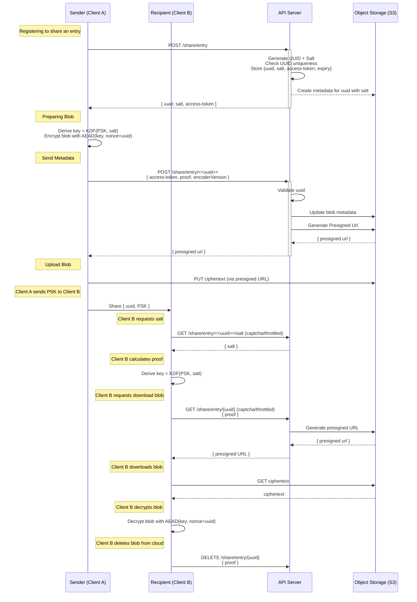

```mermaid
sequenceDiagram
    participant ClientA as Sender (Client A)
    participant ClientB as Recipient (Client B)
    participant API as API Server
    participant Storage as Object Storage (S3) 

    Note left of ClientA: Registering to share an entry
    ClientA->>+API: POST /share/entry
    API->>API: Generate UUID + Salt<br/>Check UUID uniqueness<br/>Store {uuid, salt, access-token, expiry}
    API-->>Storage: Create metadata for uuid with salt 
    API-->>-ClientA: { uuid, salt, access-token }

    Note left of ClientA: Preparing Blob
    ClientA->>ClientA: Derive key = KDF(PSK, salt)<br/>Encrypt blob with AEAD(key, nonce=uuid)
    
    Note left of ClientA: Send Metadata
    ClientA->>+API: POST /share/entry/<<uuid>><br/>{ access-token, proof, encoderVersion }
    API->>API: Validate uuid
    API->>Storage: Update blob metadata
    API->>Storage: Generate Presigned Url
    Storage-->>API: { presigned url }
    API-->>-ClientA: { presigned url }
    
    Note left of ClientA: Upload Blob
    ClientA->>Storage: PUT ciphertext (via presigned URL)

    Note left of ClientA: Client A sends PSK to Client B
    ClientA->>ClientB: Share { uuid, PSK }

    Note left of ClientB: Client B requests salt
    ClientB->>API: GET /share/entry/<<uuid>>/salt (captcha/throttled)
    API-->>ClientB: { salt }

    Note left of ClientB: Client B calculates proof  
    ClientB->>ClientB: Derive key = KDF(PSK, salt)

    Note left of ClientB: Client B requests download blob
    ClientB->>API: GET /share/entry/{uuid} (captcha/throttled)<br/>{ proof }
    API->>Storage: Generate presigned URL
    Storage-->>API: { presigned url }
    API-->>ClientB: { presigned URL }

    Note left of ClientB: Client B downloads blob
    ClientB->>Storage: GET ciphertext
    Storage-->>ClientB: ciphertext

    Note left of ClientB: Client B decrypts blob
    ClientB->>ClientB: Decrypt blob with AEAD(key, nonce=uuid)

    Note left of ClientB: Client B deletes blob from cloud
    ClientB->>API: DELETE /share/entry/{uuid}<br/>{ proof }

```